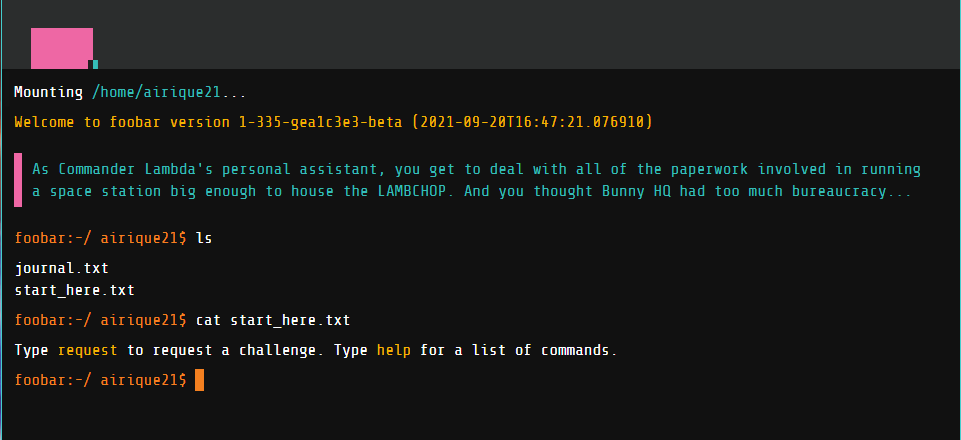

# My experiences with Google's Foobar (part 1)
## September 20, 2021

A few months ago, while researching a problem for my [membrane capacitance calculator program](https://github.com/ericlumsden/cmMeas), I received a pop-up in my Chrome browser that said:

*Interested programmers solve interesting problems. Do you want to help Google solve some?*

I was naturally interested and clicked the link, which brought me to Google's foobar, an invitation-only, hidden coding challenge. I had never heard of the foobar challenge before, but when I was redirected to the foobar website I quickly checked to make sure I wasn't about to be scammed. It turns out this is a well known coding challenge in the CS world, with some people even finding ways to hack into an invitation by [searching for specific keywords](https://dev.to/tasinishmam/cracking-google-s-foobar-challenge-2c7k). As a self-taught programmer with limited experience I thought it would provide a wonderful opportunity to test my progress and decided to proceed with the challenge. As I currently write this I am approximately 3/5 of the way through and will be detailing my experiences in a series of posts here on my blog. I will not, however, be posting any of my code I wrote to solve the problems in a public repository as I want to avoid people cheating off of my work. My solutions are instead hosted in a private repository for recruiters or potential employers upon request.

Before getting into my epxeriences tackling the problems, I first want to give a bit more context to foobar itself. Foobar is structured as a pseudo-integrated development environment where you can navigate through directories, read about the challenge itself and request challenges through simple terminal commands, such as `ls` or `cat`. 

There are five challenges, most of which are made up of sub-challenges, that you can request at your leisure and you are afforded seven days to complete each challenge. Most challenges take less time, I finished the first challenge in under two hours, but as you progress the challenges get increasingly more complicated and some have taken me the entire week.

